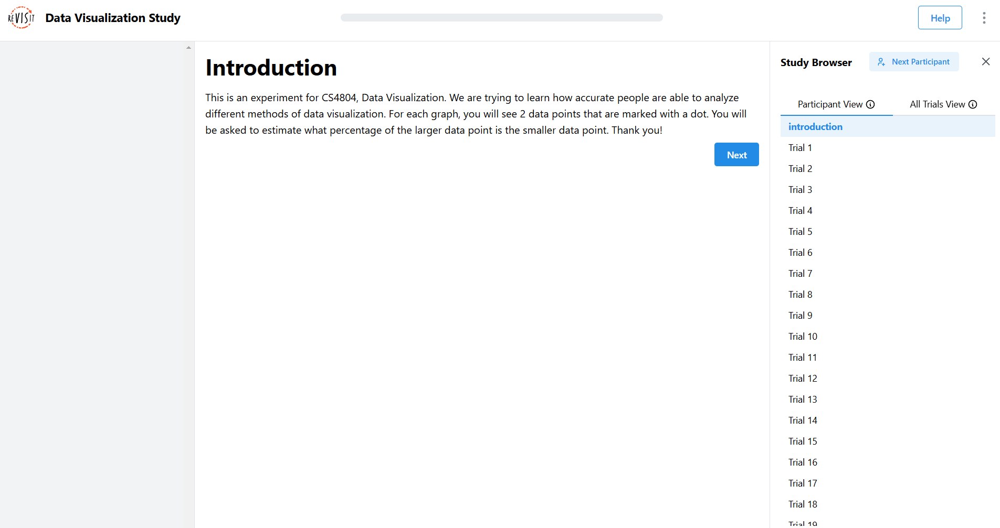
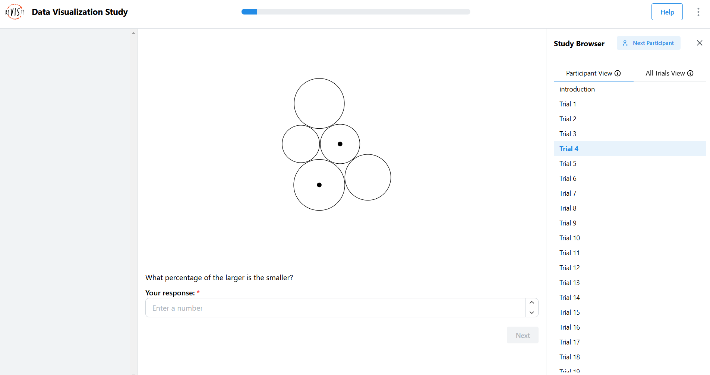
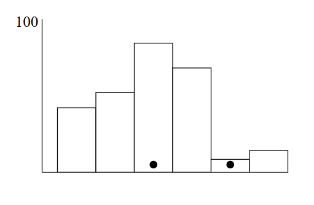
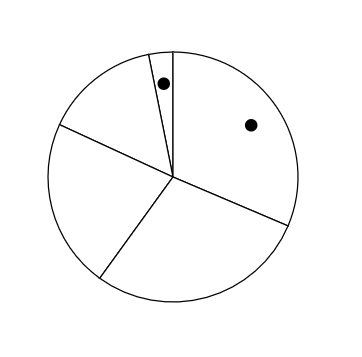
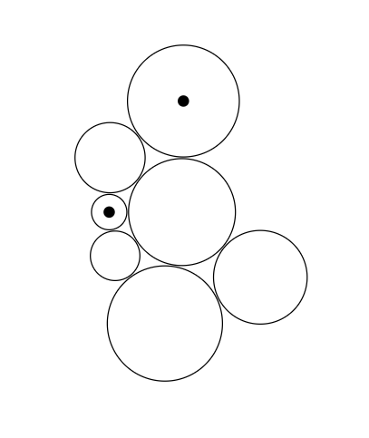

# Assignment 3 - Replicating a Classic Experiment  

In this assignment, we conducted a controlled experiment about the accuracy of people gauging different kinds of data visualizations. d3 was used to make the visualizations and ReVISit was used to conduct the experiment. After we collected data, we did some data-analysis. 

## Visualizations

We chose 3 visualizations and from best to worst, they were

# TODO CHANGE ORDER

Bar

---

Pie

---

Bubble

 

### Technical Achievement

One of our technical achievements was learning how to set and use ReVISit, a library to make web-based studies. While there wasn't a significant amount of setup, there was a lot of debugging since we were all unfamiliar with the application. Once we figured out how to at least locally host the experiment, we also ran into issues with how to apply the randomness as full randomness of the order, types of charts, percent differences, etc. would require a significant amount of work. Instead, we settled on a set order for the percent differences and type of visualization for ease of data analysis but randomized what it looked like each time. 

### Design Achievement

We decided to branch out and instead of doing both a bar chart and a stacked bar chart, which would have been very similar, decided to do a pie and bubble chart. While both are circular, their d3 development was quite differnet. A stuggle that occured with the pie chart was making the dots that marked the pieces actually show up in the center of each slice. With the bubble charts, it would sometimes generate too many circles and make the visualization look messy, possibly skewing the data. However, the design choices to use these data visualization types gives us a more interesting data analysis. 

#### Note
The survey is supposed to be hosted [here](https://dar-th0va-dar.github.io/a3-revisit/) but we couldn't figure out why it wasn't working in time