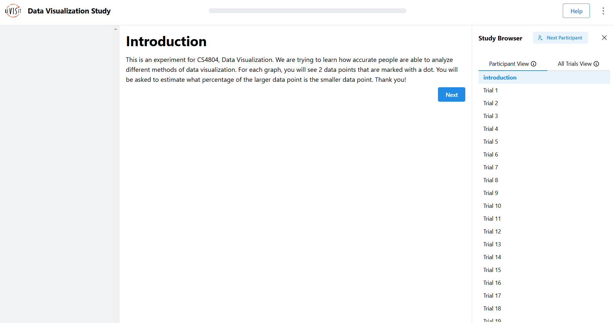
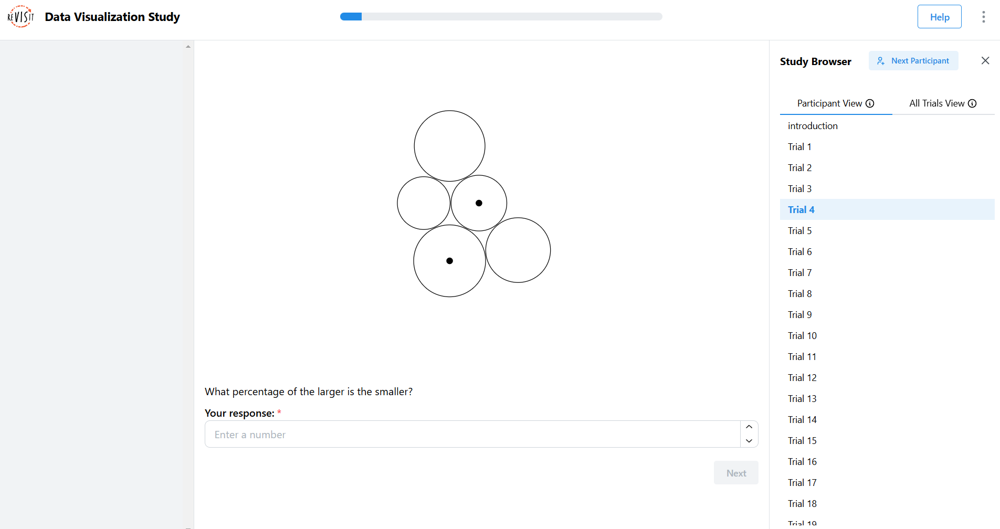
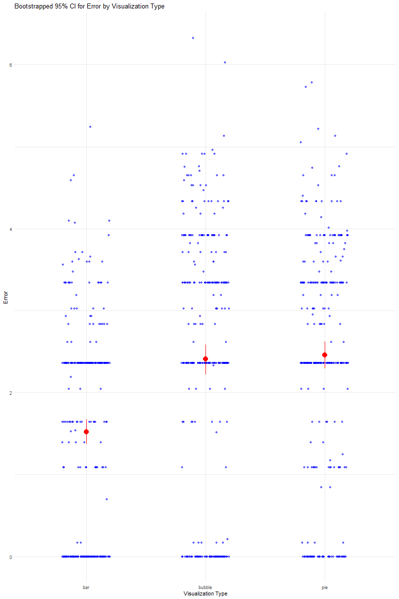
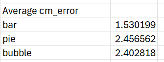
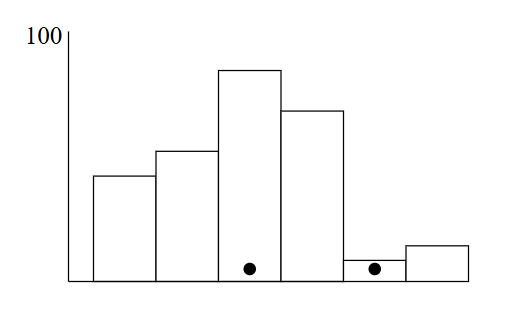
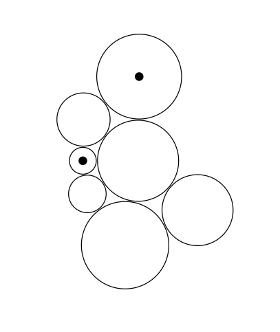
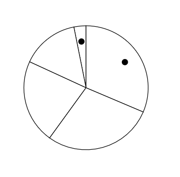

# Assignment 3 - Replicating a Classic Experiment  

In this assignment, we conducted a controlled experiment about the accuracy of people gauging different kinds of data visualizations. d3 was used to make the visualizations and ReVISit was used to conduct the experiment. After we collected data, we did some data-analysis. 

## Visualizations

Results: 

We chose 3 visualizations and from best to worst, they were

Bar

The average Cleveland and McGill error rate for our bar chart was 1.53, which was the lowest error rate produced overall. Looking at the bootstrapped confidence interval, most of the points are clustered towards the bottom, meaning that most participants were not too far off from the actual value. The points tended to be spread around the mean error which leaned towards the bottom. This error rate was very close to the one that Cleveland and McGill obtained from their study but ours was slightly higher.

---
Bubble

The average Cleveland and McGill error rate for our bubble chart was 2.403, which was also very close to the error rate of our pie chart. Looking at the bootstrapped confidence interval, the points seem to be more spread out with some points having very low error rates, some having error rates close to the mean, and some having high error rates. Since the confidence intervals for the bubble and pie charts overlap, the differnce in their errors are not statistically significant. The error rate we obtained is slightly lower than the one Cleveland and McGill obtained from their study for a bubble chart.

---
Pie

The average Cleveland and McGill error rate for our pie chart was 2.456, which was the highest error rate produced overall. Looking at the bootstrapped confidence interval, the points seem similair to the CI for our bubble chart except they are slightly more spread out and have more points concentrated towards the top.This visualization had the lowest accuracy and had a lot of variation among participants. The error rate we obtained is slightly lower than the one Cleveland and McGill obtained from their study for a bubble chart.
---

### Technical Achievement

One of our technical achievements was learning how to set and use ReVISit, a library to make web-based studies. While there wasn't a significant amount of setup, there was a lot of debugging since we were all unfamiliar with the application. Once we figured out how to at least locally host the experiment, we also ran into issues with how to apply the randomness as full randomness of the order, types of charts, percent differences, etc. would require a significant amount of work. Instead, we settled on a set order for the percent differences and type of visualization for ease of data analysis but randomized what it looked like each time. We aditionally used Excel to obtain our error rates and R to obtain our bootstrapped confidence intervals. We used the log function in Excel and learned to to create bootstraped confidence intervals in R.

### Design Achievement

We decided to branch out and instead of doing both a bar chart and a stacked bar chart, which would have been very similar, decided to do a pie and bubble chart. While both are circular, their d3 development was quite different. A struggle that occured with the pie chart was making the dots that marked the pieces actually show up in the center of each slice. With the bubble charts, it would sometimes generate too many circles and make the visualization look messy, possibly skewing the data. However, the design choices to use these data visualization types gives us a more interesting data analysis. We aditionally designed our confidence intervals in one graph to make it easier to compare. We made the mean interval a seperate color as well so that it is easy to distinguish from the rest of the points.

#### Note
The survey is supposed to be hosted [here](https://dar-th0va-dar.github.io/a3-revisit/) but we couldn't figure out why it wasn't working in time